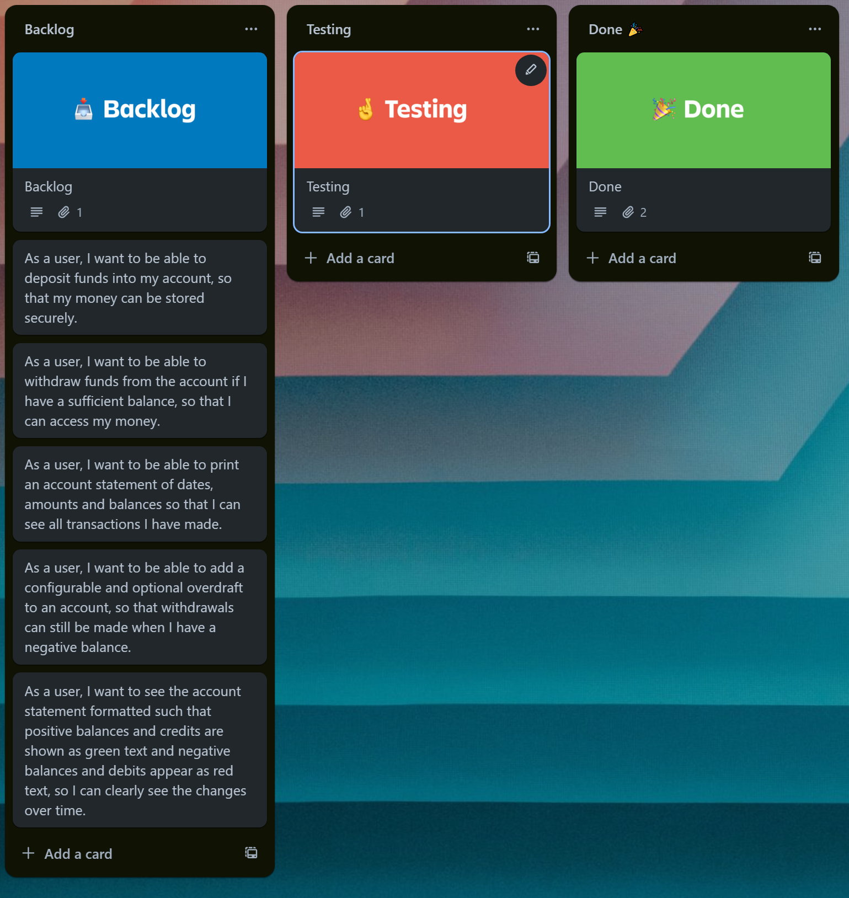

# Domain Models and Test Plan

Task 1:

The software will benefit the client as it will provide another way for their customers to access their bank account, allowing them to compete with other banks who may already have this option available to their customers. It will also benefit the business to offer this application to their customers, since their customers will be likely to use this more often as it is more convenient, which in turn will allow them to save money on rent and other operating costs, because they may not need as many brick and mortar branches. Another benefit to the client of this software is that it is modular and therefore easily reusable. This would allow them to extend it and add more features in the future, which will save them time and money later on if it proves to be a popular application.

The customers will also benefit massively from this software, since it would allow them to access their account and by extension their funds remotely, without having to make a trip to the bank, which will save them time as they won't have to make as many journeys to the bank's branches. In addition, having this software will benefit the customers as it will allow them to keep track of how much money they no matter where they are, which will be very beneficial for them in terms of keeping track of and managing their finances effectively. 

User Stories and Domain Models

As a user, I want to be able to deposit funds into my account, so that my money can be stored securely.

| Objects     | Properties                             | Messages                               | Output |
|-------------|----------------------------------------|----------------------------------------|--------|
| Account     | transactionHistory Array[@Transaction] | depositFunds(@String, @Integer)        |        |
|             | balance @Integer                       |                                        |        |
| Transaction | date @String                           |                                        |        |
|             | credit @Integer                        |                                        |        |

As a user, I want to be able to withdraw funds from the account if I have a sufficient balance, so that I can access my money.

| Objects     | Properties                             | Messages                                | Output |
|-------------|----------------------------------------|-----------------------------------------|--------|
| Account     | transactionHistory Array[@Transaction] | withdrawFunds(@String, @Integer)        |        |
|             | balance @Integer                       |                                         |        |
| Transaction | date @String                           |                                         |        |
|             | debit @Integer                         |                                         |        |

As a user, I want to be able to print an account statement of dates, amounts and balances so that I can see all transactions I have made.

| Objects   | Properties                             | Messages                            | Output |
|-----------|----------------------------------------|-------------------------------------|--------|
| Account   | transactionHistory Array[@Transaction] | printStatement(Array[@Transaction]) |        |

As a user, I want to see the account statement formatted such that positive balances and credits are shown as green text and negative balances and debits appear as red text, so I can clearly see the changes over time.

| Objects   | Properties                             | Messages                            | Output |
|-----------|----------------------------------------|-------------------------------------|--------|
| Account   | transactionHistory Array[@Transaction] | printStatement(Array[@Transaction]) |        |

As a user, I want to be able to add a configurable and optional overdraft to an account, so that withdrawals can still be made when I have a negative balance.

| Objects     | Properties                             | Messages                                | Output |
|-------------|----------------------------------------|-----------------------------------------|--------|
| Account     | transactionHistory Array[@Transaction] | withdrawFunds(@String, @Integer)        |        |
|             | balance @Integer                       |                                         |        |
|             | overdraft @Integer                     |                                         |        |
| Transaction | date @String                           |                                         |        |
|             | debit @Integer                         |                                         |        |

